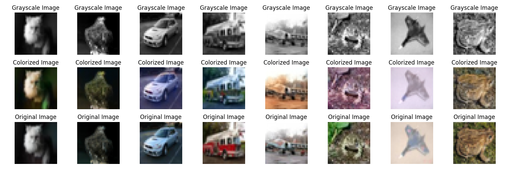

# Gray2RGB Diffusion - Image Colorization using Diffusion Models

This repository implements image colorization using a diffusion-based approach inspired by the paper **"Palette:
Image-to-Image Diffusion Models"**. The model is trained to predict the colorized version of grayscale images. Due to
computational constraints, the model has been trained on **32x32** images from the CIFAR-10 dataset.

---

## 📜 Reference

- **Paper**: [Palette: Image-to-Image Diffusion Models](https://arxiv.org/abs/2111.05826)

---

## 🖼️ Dataset

The CIFAR-10 dataset is used for training and evaluation. Images are resized to **32x32** for computational efficiency.

---

## 🚀 Features

- **Diffusion-based Colorization**: Utilizes a diffusion process to progressively denoise grayscale images into
  colorized outputs.
- **Customizable Configurations**: Adjust model architecture, training parameters, and dataset preprocessing via
  configuration files.
- **Efficient Training**: Supports training on smaller image sizes for resource-constrained environments.

---

## 🛠️ Installation

1. Clone the repository:
   ```bash
   git clone https://github.com/kishore-s-15/Gray2RGBDiffusion.git
   cd Gray2RGBDiffusion
   ```

2. Install dependencies:
   ```bash
   pip install -r requirements.txt
   ```

---

## 🏋️‍♂️ How to Train

To train the model, use the training script:
```bash
python gray2rgb_diffusion/scripts/train_script.py
```

### ⚙️ Training Configuration

The training parameters (batch size, learning rate, etc.) are defined in `configs/config.py`. You can modify them as
needed.

---

## 🧪 How to Run Inference

To perform inference and visualize results:

```bash
python gray2rgb_diffusion/scripts/inference_script.py
```

### 🧹 Outputs



---

## 📊 Results

Due to training on smaller images (32x32), the results are limited compared to the full implementation in the original
paper. However, this implementation demonstrates the potential of diffusion-based models for image colorization.

| Metrics                     | Scores |
|-----------------------------|--------|
| Fréchet Inception Distance  | 10.6   |
| Inception Score            | 198.3  |

---

## 📂 File Structure

```plaintext
├── configs/                # Configuration files
│   └── config.py           # Training and inference parameters
├── data/                   # Dataset-related scripts
│   └── dataset.py          # Custom CIFAR-10 dataset with grayscale preprocessing
├── evaluation/             # Generated Images Evaluation related scripts
│   └── evaluations.py      # Fréchet inception distance and Inception score metrics
├── inference/              # Inference-related scripts
│   └── infer.py            # File consists of code for generating new images
├── models/                 # Model architecture and utilities
│   ├── model.py            # UNet2D model definition
│   └── save_model.py       # Model save/load functions
├── scripts/                # Training and inference scripts
│   ├── train_script.py     # Training pipeline
│   └── inference_script.py # Inference pipeline
├── training/               # Training-related scripts
│   └── train.py            # File consists of code for training the diffusion model
├── utils/                  # Helper functions
│   └── transforms.py       # Preprocessing and reverse transforms
└── requirements.txt        # Python dependencies
```

---

## 📧 Contact

For questions or issues, feel free to open a GitHub issue.

- Kishore Sampath, sampath.ki@northeastern.edu
- Pratheesh, lnu.prat@northeastern.edu
